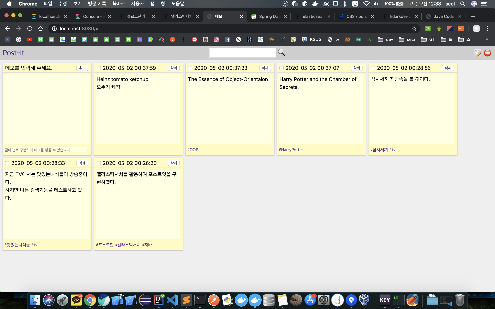
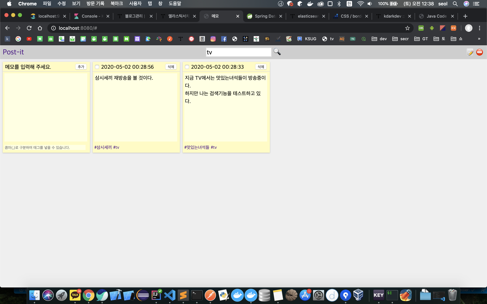
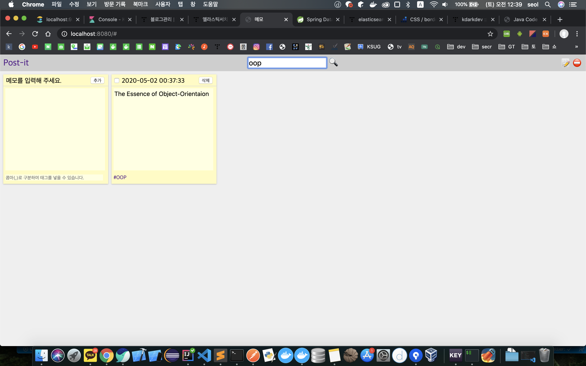

# 포스트잇(Post-it)

## 사용기술

- ElasticSearch 6.4.3
  - nori 한글형태소 분석기
- Kibana(DevTool)
- SpringBoot 2.2.6
  - org.elasticsearch.client:elasticsearch-rest-high-level-client

※ spring-boot-starter-data-elasticsearch를 사용하려고 했으나 SpringBoot와 ElasticSearch 버전호환이 되지않음.  
2.1.x버전으로 돌아가자니 변경사항이 많아보이고, API연동간에 자동으로 달라붙는 파라메터만 조금 손보면 가능할것같은데 구글링해도 도무지 방법이 나오지 않았다.  
그래서 Elastic에서 제공하는 client를 활용하여 연동하였다.

## Script

[ElasticSearch Index생성 스크립트](./script/ElisticSearch.script)

## Screenshot

